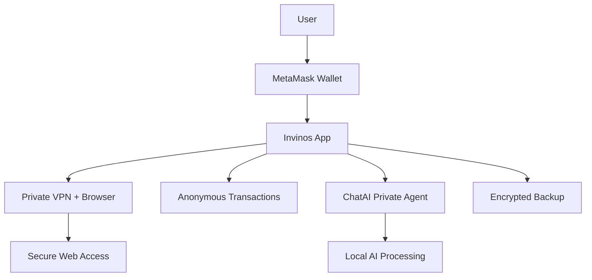

# 🛡️ Invinos — The Privacy OS for Web3 & AI

**Invinos** is a decentralized, privacy-first mobile platform for Web3. It combines a private browser with VPN, anonymous crypto transactions, and a secure local ChatAI agent — all powered by your own MetaMask wallet.

---

## 📲 Download APK

- 🔗 [Download Invinos v1.20 from invinos.com](https://invinos.com/download)

---

## 🔐 Key Features

- **Private Browser + VPN** — Browse freely, block trackers & censorship
- **Anonymous Crypto Wallet** — Use MetaMask to transact without KYC
- **ChatAI Agent (Private LLM)** — Local AI assistant with no cloud dependency
- **Encrypted Backup** — Your data, your control
- **Wallet-Based Login** — Authenticate using MetaMask

---

## 🧠 Architecture Overview



---

## 📦 File Info

* **Version:** 1.20
* **Platform:** Android
* **Size:** \~\[file size] MB

---

## 📜 License

Invinos is released for public use. You may download, share, and test the APK freely. We do not collect or store user data.

---

## 🌍 Learn More

* Website: [invinos.com](https://invinos.com)

```
